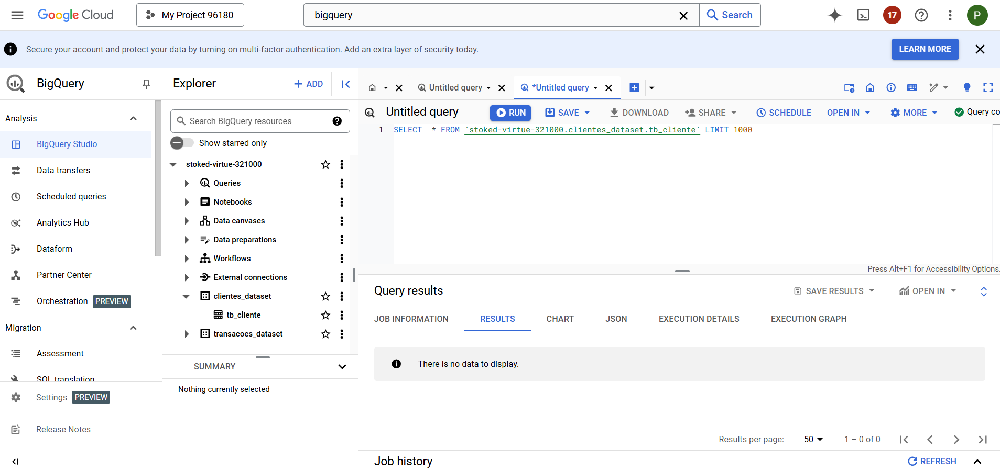
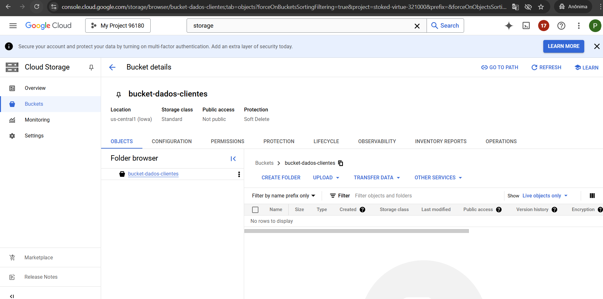

# Um pipeline no Google Cloud Platform (GCP) para que, ao adicionar um novo arquivo cliente.csv no Cloud Storage, os dados sejam automaticamente carregados ou atualizados na tabela tb_cliente no BigQuery. Aqui está como você pode fazer isso:

# Visão Geral do Pipeline
Cloud Storage:

O arquivo cliente.csv é enviado para um bucket específico.
O evento de upload no bucket aciona uma função no Cloud Functions.
Cloud Functions:

A função lê o arquivo do bucket.
Insere os dados no BigQuery, usando a API do BigQuery.
BigQuery:

A tabela tb_cliente é atualizada com os dados do arquivo.
# Passo a Passo
1. Criação do Bucket no Cloud Storage
Acesse o Console do GCP.
Navegue até Storage > Buckets.
Crie um bucket (exemplo: bucket-dados-clientes).
2. Criação da Tabela no BigQuery
Acesse o BigQuery no Console.
Crie um conjunto de dados (dataset) chamado clientes_dataset.
Crie uma tabela chamada tb_cliente com os campos:
id_cliente: INTEGER
nm_cliente: STRING
end_cliente: STRING
cid_cliente: STRING
est_cliente: STRING
pais_cliente: STRING
3. Código para a Cloud Function
Crie uma Cloud Function que será acionada sempre que um arquivo for enviado ao bucket.

Código Python (main.py):

python
Copiar código
import os
import csv
from google.cloud import storage, bigquery

# Configurações
PROJECT_ID = "stoked-virtue-321000"  # Substitua pelo seu ID do projeto
DATASET_ID = "clientes_dataset"
TABLE_ID = "tb_cliente"

def carregar_dados(event, context):
    """Função acionada pelo upload de um arquivo no Cloud Storage."""
    bucket_name = event['bucket']
    file_name = event['name']
    
    # Verifica se o arquivo é o cliente.csv
    if file_name != "cliente.csv":
        print(f"Arquivo {file_name} ignorado.")
        return

    client_storage = storage.Client()
    bucket = client_storage.bucket(bucket_name)
    blob = bucket.blob(file_name)
    dados = blob.download_as_text()

    linhas = []
    reader = csv.DictReader(dados.splitlines())
    for row in reader:
        linhas.append({
            "id_cliente": int(row["id_cliente"]),
            "nm_cliente": row["nm_cliente"],
            "end_cliente": row["end_cliente"],
            "cid_cliente": row["cid_cliente"],
            "est_cliente": row["est_cliente"],
            "pais_cliente": row["pais_cliente"]
        })

    # Insere os dados no BigQuery
    client_bq = bigquery.Client()
    tabela_ref = f"{PROJECT_ID}.{DATASET_ID}.{TABLE_ID}"
    errors = client_bq.insert_rows_json(tabela_ref, linhas)

    if errors:
        print(f"Erros ao inserir dados no BigQuery: {errors}")
    else:
        print(f"Dados do arquivo {file_name} carregados com sucesso.")
4. Configuração do requirements.txt
Adicione o seguinte conteúdo ao requirements.txt:

Copiar código
google-cloud-storage==2.11.0
google-cloud-bigquery==3.10.0
5. Implantação da Cloud Function
Acesse o Cloud Functions no Console.

Clique em Criar Função:

Nome: carregar_dados_cliente
Região: Escolha uma próxima de você.
Trigger: "Cloud Storage" e selecione o bucket criado (bucket-dados-clientes).
Evento: "Finalização/Criação (on finalize)".
Nome do arquivo: cliente.csv.
Configure o tempo de execução:

Ambiente de execução: Python 3.10 ou superior.
Entrada do código: Faça o upload do main.py e requirements.txt.
Clique em Deploy.

6. Testando o Pipeline
Faça o upload de um arquivo cliente.csv para o bucket.

Acesse Storage > Buckets > Selecione o bucket.
Faça o upload do arquivo.
Verifique os logs da Cloud Function para confirmar o processamento.

Consulte a tabela tb_cliente no BigQuery:

Acesse BigQuery no Console.
Execute a consulta:
sql
Copiar código
SELECT * FROM `stoked-virtue-321000.clientes_dataset.tb_cliente`;

7. Limpeza (Opcional)
Exclua os recursos se não forem mais necessários (bucket, tabela, função, etc.).
Pronto! Você agora tem um pipeline funcional que processa arquivos CSV no Cloud Storage e atualiza uma tabela no BigQuery automaticamente.

